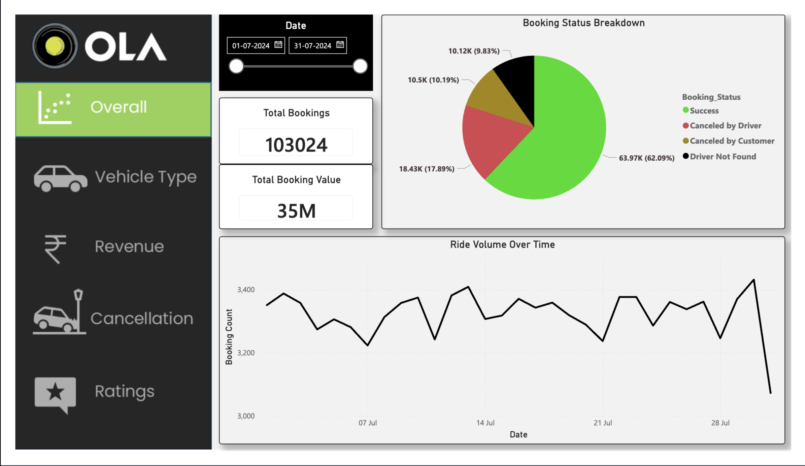

# 🚕 Ola Ride Data Analytics – End-to-End Project

An end-to-end data analytics project on Ola ride booking data using SQL, Power BI, and Excel to extract business insights on ride trends, revenue, cancellations, and ratings.

**103,024 rides analyzed · ₹35M+ booking value · 62% success rate**

## Dashboard Preview

*Overall page: total bookings, total booking value, booking status breakdown, and daily ride volume trend.*

## Project Objective

To analyze Ola ride data and answer real-world business questions such as:

- What is the daily ride volume trend?
- Which vehicle types generate maximum booking value?
- Why are rides getting cancelled?
- Which customers contribute the highest revenue?
- How do customer and driver ratings vary across vehicle types?

## Tools & Technologies

- **SQL (MySQL)** – Data querying & view creation
- **Power BI** – Interactive dashboard & KPIs
- **MS Excel** – Initial data cleaning & validation

## Dataset Description

| Column | Description |
|---|---|
| Date, Time | Ride date & time |
| Booking_ID | Unique booking ID |
| Booking_Status | Success / Cancelled / Driver Not Found |
| Customer_ID | Unique customer ID |
| Vehicle_Type | Prime Sedan, Mini, Bike, Auto, etc. |
| Pickup_Location, Drop_Location | Ride locations |
| V_TAT, C_TAT | Turn-around times |
| Cancelled_Rides_by_Customer | Customer cancellation reason |
| Cancelled_Rides_by_Driver | Driver cancellation reason |
| Incomplete_Rides, Incomplete_Rides_Reason | Incomplete ride details |
| Booking_Value | Revenue of ride |
| Payment_Method | Cash, UPI, Card |
| Ride_Distance | Distance travelled |
| Driver_Ratings, Customer_Rating | Ride ratings |

## SQL Analysis Performed

- Retrieve all successful bookings
- Average ride distance by vehicle type
- Total cancelled rides by customers & drivers
- Top 5 customers by total bookings
- Driver cancellation due to personal & car-related issues
- Max & min driver ratings for Prime Sedan
- Rides paid using UPI
- Average customer rating per vehicle type
- Total booking value of successful rides
- All incomplete rides with reasons

All SQL queries and views are available inside the [`sql`](sql/) folder.

## Power BI Dashboard Pages

| Page | Insights |
|---|---|
| Overall | Ride volume trend, booking status breakdown |
| Vehicle Type | Total & successful booking value, avg. distance |
| Revenue | Revenue by payment method, top customers |
| Cancellation | Customer & driver cancellation reasons |
| Ratings | Driver ratings vs. customer ratings |

## Key Business Insights

- **62.09%** of bookings completed successfully (63.97K of 103,024 rides).
- Driver-side cancellations (**17.89%**) outweigh customer-side cancellations (**10.19%**) — the primary source of lost rides.
- Cash & UPI contribute more than 85% of total revenue.
- Prime Sedan & Prime Plus are the highest revenue-generating vehicle types.
- Average customer & driver ratings stay close to 4.0, indicating stable service quality.

## Author

**Vishal Bana**
Data Analytics Enthusiast | IIT (BHU) Varanasi
[LinkedIn](https://www.linkedin.com/in/vishal-bana-8b0502393) · [GitHub](https://github.com/vishalbana2005-alt)

